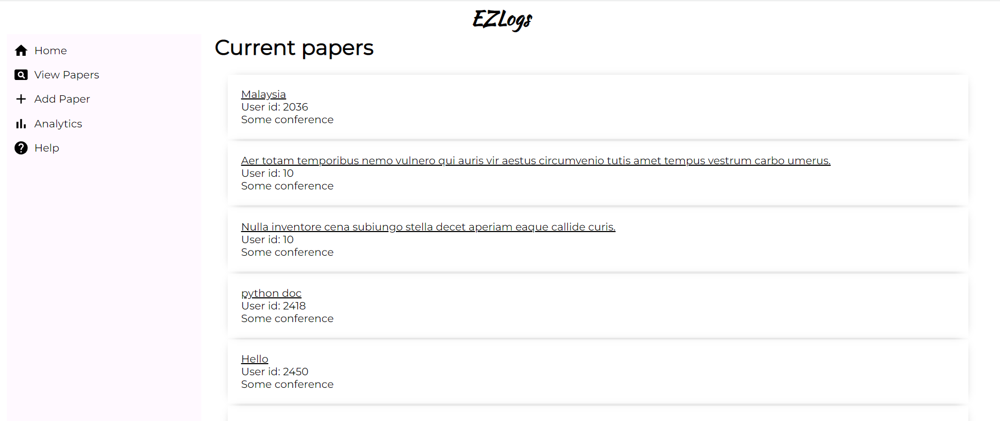
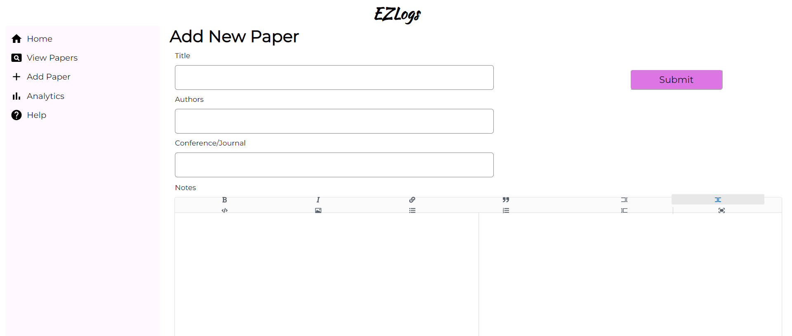
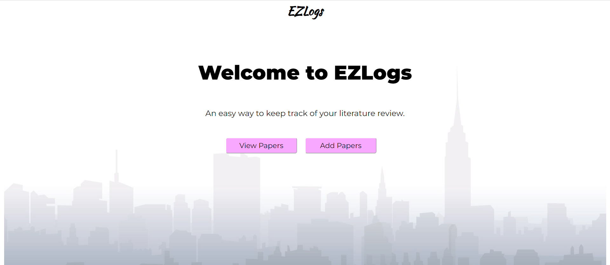

# EZLogs
A web interface to help researchers keep track of the papers they read. 
Researchers can write notes on the papers in a built-in markdown editor and store them in a database along with the papers' title, authors and conference/journal. 
The app is written in Reactjs.

Following are some screenshots: 
 \
 \
 \

